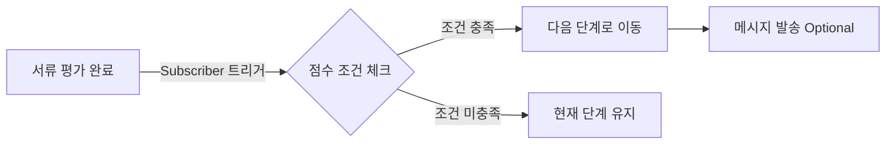

# 서류 평가 개선 기획 (업데이트)

> **작성일:** 2026.01.20  
> **상태:** Discovery 완료 → PRD 작성 준비  
> **참고:** 코드 분석 + VOC + 인터뷰 종합

---

## 📊 문제 정의

### 핵심 Pain Point
> **"서류 평가 단계가 하나뿐이라 1,2차 평가를 나누어 진행할 수 없다"**

| 고객사 | Pain Point | 영향 |
|:---|:---|:---|
| 게임듀오 | 순차적 평가 요청 불가 (a→b) | 알림 타이밍 제어 불가 |
| 기어세컨드 | 1차 평가 코멘트 미공유 | 2차 평가자가 맥락 없이 평가 |
| 페이멘트랩 | 수동 알림 + 반복 설명 | 업무 시간 30% 낭비 |

---

## 🛠️ 현재 시스템 분석

### 서류 평가 자동화 (AutoActionReview)

**위치:** `round-server/app/models/auto_actions/auto_action_review.rb`

```ruby
# 현재 지원 기능
- 점수 기준 조건 (≥, ≤, >, <)
- 조건 충족 시 다음 단계 자동 이동
- 불합격 시 실패 사유 자동 설정
- 안내 메시지 자동 발송
```

**트리거:** `FeedbackCandidateScoreAutomationSubscriber`
- 서류 평가(FeedbackCandidateScore) 완료 시 자동화 액션 실행

**Frontend UI:** `apps/round/src/components/templates/job/detail/automation/review/`

### 현재 자동화 플로우



### 한계점 (개선 필요)

| 현재 | 한계 | 필요 기능 |
|:---|:---|:---|
| 다음 단계 이동만 지원 | 2차 평가자 추가 불가 | 평가자 자동 추가 액션 |
| 점수 기준만 지원 | 결과(합격/불합격) 기준 없음 | 결과 기반 조건 |
| 단일 조건만 지원 | 복합 조건 불가 | AND/OR 조건 |

---

## 💡 Solution 방향

### Option 1: 기존 AutoAction 확장 (권장) ⭐

기존 `AutoActionReview` 패턴을 확장하여 **"2차 평가자 추가"** 액션 타입 추가

```ruby
# 신규 모델 (예시)
class AutoActionReviewRound < ApplicationRecord
  # 트리거 조건
  belongs_to :trigger_score_condition  # 점수 기준
  # OR
  enum :trigger_result, { pass: 'pass', hold: 'hold' }  # 결과 기준
  
  # 액션
  has_many :next_evaluators  # 2차 평가자 목록
  belongs_to :next_stage, optional: true  # 다음 단계 (선택)
end
```

**장점:**
- 기존 Subscriber/Job 패턴 재사용
- UI도 기존 자동화 설정 페이지에 탭 추가로 해결
- 리스크 낮음

### Option 2: 신규 시스템 개발

완전히 새로운 "다단계 서류 평가" 시스템 구축

**단점:**
- 개발 비용 높음
- 기존 고객 마이그레이션 필요

---

## 🎯 Opportunities (우선순위)

### 🥇 Tier 1: 핵심 문제 해결

| # | 기능 | 설명 | 기대 효과 |
|:---:|:---|:---|:---|
| O1 | **2차 평가자 자동 추가** | 1차 평가 완료 시 2차 평가자 자동 추가 + 알림 | 수동 알림 제거 |
| O2 | **평가 코멘트 공유** | 2차 평가자가 1차 평가 코멘트 확인 가능 | 반복 설명 제거 |

### 🥈 Tier 2: 조건 고도화

| # | 기능 | 설명 |
|:---:|:---|:---|
| O3 | **결과 기반 조건** | 점수 외에 "합격/보류/불합격" 기준 트리거 |
| O4 | **복합 조건 (다중 평가자 AND)** | 1차 평가자 A "합격" AND 1차 평가자 B "합격" 시 2차 진행 |

### 🥉 Tier 3: 추가 개선

| # | 기능 | 설명 |
|:---:|:---|:---|
| O5 | 평가 현황 대시보드 | 1차/2차 진행률 한눈에 확인 |
| O6 | 평가 기한 + 리마인더 | 마감일 설정 및 자동 알림 |
| O7 | 3차 이상 확장 | N차 평가 지원 |

---

## 🔧 기술 구현 방향

### Backend 변경

```
round-server/
├── app/models/auto_actions/
│   ├── auto_action_review.rb          # 기존 (수정)
│   └── auto_action_review_round.rb    # 신규
├── app/subscribers/feedbacks/
│   └── feedback_candidate_score_automation_subscriber.rb  # 수정
└── app/jobs/auto_action/
    └── execute_job.rb  # 2차 평가자 추가 로직 추가
```

### Frontend 변경

```
when-front/apps/round/src/components/templates/job/detail/automation/
├── review/
│   ├── JobAutoReviewTemplate.tsx       # 기존 (수정)
│   └── components/
│       └── JobAutoReviewRoundConfig.tsx  # 신규: 2차 평가자 설정 UI
└── components/
    └── AutoActionEvaluatorSelector.tsx   # 신규: 평가자 선택 컴포넌트
```

### API 변경

```
POST /api/jobs/:job_id/auto_action_review_rounds
  - trigger_condition: { score: 70, operator: 'gte' } | { result: 'pass' }
  - next_evaluator_ids: [user_id, ...]
  - send_notification: true
  - message_template_id: optional
```

---

## ✅ 검증 계획

### 자동화 테스트
- 기존 `spec/subscribers/feedbacks/feedback_candidate_score_automation_subscriber_spec.rb` 확장
- 2차 평가자 추가 로직 테스트 케이스 추가

### 수동 테스트
1. 공고 > 자동화 설정 > 서류 평가 > 2차 평가자 설정
2. 지원자 1차 평가 완료
3. 조건 충족 시 2차 평가자 자동 추가 확인
4. 2차 평가자에게 알림 전송 확인
5. 2차 평가자가 1차 평가 코멘트 확인 가능 여부

---

## 📋 Next Steps

1. [ ] PRD 작성 (Tier 1: O1, O2 스코프)
2. [ ] 디자인 검토 (UI 설계)
3. [ ] 개발 착수
4. [ ] 베타 테스트 (게임듀오, 기어세컨드)

---

*작성: Terry / Initiative: document-review-improvement*
