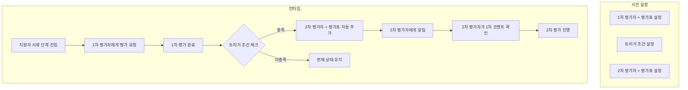

# PRD: 다단계 서류 평가 자동화

> **작성일:** 2026.01.20  
> **작성자:** Terry  
> **상태:** Draft  
> **Initiative:** document-review-improvement

---

## 🎯 Overview

### 한 줄 요약
> **1차 평가 완료 시 2차 평가자와 평가표가 자동으로 추가되어, 채용 담당자가 수동 설정 없이 순차적 서류 평가를 진행할 수 있게 한다.**

### 배경
현재 라운드HR은 서류 평가 단계가 1개만 지원되고, 평가도 1개만 추가할 수 있다. 이로 인해 1차/2차 서류 평가를 나누어 진행하는 고객은 수동으로 평가자를 추가하고 알림을 보내야 하는 불편함이 있다.

---

## ⚠️ 현재 문제

### 시스템 제약
| 항목 | 현재 상태 | 고객 니즈 |
|:---|:---|:---|
| 서류 평가 단계 | **1개** | 1차/2차 분리 |
| 평가 추가 | **1개만 가능** | 여러 평가 순차 추가 |
| 알림 타이밍 | 등록 시 즉시 발송 | 순차적 발송 (1차 완료 후 2차) |

### 고객 워크아라운드
- 슬랙/메일로 수동 알림
- '진행 중' 단계를 2차 서류검토로 활용 (혼란 유발)
- '+추가' 탭으로 수동 평가자 등록 (코멘트 미공유)

## 🧑‍💼 Jobs to Be Done (JTBD)

### Primary Job
> **"내가 [1차 서류 평가를 완료]했을 때, [자동으로 2차 평가자에게 요청이 가서], [수동 알림 없이 순차적 평가를 진행]하고 싶다."**

### Secondary Jobs
| Job | 현재 Pain | 기대 결과 |
|:---|:---|:---|
| 2차 평가자가 1차 평가 맥락을 알고 싶다 | 코멘트 공유 안 됨 → 구두 설명 필요 | 1차 평가 코멘트 자동 공유 |
| 여러 1차 평가자가 모두 합격해야 2차로 넘기고 싶다 | 수동 확인 필요 | AND 조건 자동 체크 |
| 평가 진행 현황을 한눈에 보고 싶다 | 개별 클릭해서 확인 | 대시보드 (Tier 2) |

---

## 👥 Target Users

### Primary: 채용 담당자 (HR팀)
- 1차 서류 스크리닝 담당
- 현업에 2차 평가 요청하는 역할
- **Pain**: 슬랙/메일로 일일이 알림, 평가 맥락 재설명

### Secondary: 현업 평가자 (팀장/리드)
- 2차 서류 심층 평가 담당
- **Pain**: 1차 평가자가 왜 통과시켰는지 맥락 모름

---

## 📊 고객 증거 (Evidence)

| 고객사 | Pain Point | 인용 |
|:---|:---|:---|
| 게임듀오 | 순차 평가 불가 | "a 평가자에게 먼저 요청하고, b에게 나중에 요청하고 싶은데..." |
| 기어세컨드 | 코멘트 미공유 | "2차 평가자가 1차 평가 코멘트를 확인할 수가 없어요" |
| 페이멘트랩* | 수동 알림 부담 | "슬랙으로 일일이 알려드려야 해요. 업무 시간 30%는 줄어들 것 같아요" |

*모의 인터뷰 기반

---

## ✅ 기능 요구사항

### Must Have (P0)

#### 1. 2차 평가자 자동 추가
**When:** 1차 평가자가 평가 완료했을 때  
**Action:** 설정된 2차 평가자가 자동으로 추가됨  
**Result:** 2차 평가자에게 알림 발송

```
[트리거 조건 옵션]
- 1차 평가 점수 ≥ N점
- 1차 평가 결과 = 합격
- 1차 평가자 전원 합격 (AND 조건)
```

#### 2. 평가 코멘트 공유
**What:** 2차 평가자가 1차 평가 코멘트를 확인할 수 있음  
**Where:** 지원자 상세 > 평가 탭

---

### Should Have (P1)

#### 3. 서류 평가 자동화
**What:** 1차 평가자 A, B 의 평가 결과 조합에 따라 자동화 실행  
**Use Case:** HR팀 2명이 동시에 1차 평가, 둘 다 합격이어야 현업으로 넘김, 둘 중 하나만 합격이면 보류, 둘 다 불합격이면 불합격 등등 최종 합산 결과가 아닌 각각의 결과에 따라 자동화 설정 및 실행 가능

---

## 🎨 Solution Concept

### 핵심 아이디어
> **과제 요청, 레퍼런스 체크처럼 "액션"으로 구현하여, 1차/2차 평가자와 평가표를 미리 설정하고 트리거 조건에 따라 자동 실행**

### 기존 패턴 참고
| 기능 | 트리거 | 액션 |
|:---|:---|:---|
| 과제 요청 | 특정 단계 진입 시 | 과제 양식 자동 발송 |
| 레퍼런스 체크 | 특정 단계 진입 시 | 레퍼런스 요청 자동 발송 |
| **다단계 서류 평가 (신규)** | 1차 평가 완료 시 | 2차 평가자+평가표 자동 추가 |

### 설정 화면 (공고 > 자동화 > 서류 평가 액션)

```
┌─────────────────────────────────────────────────────────┐
│ � 서류 평가 액션 설정                                      │
├─────────────────────────────────────────────────────────┤
│                                                         │
│ ☑️ 활성화                                                │
│                                                         │
│ ┌─────────────────────────────────────────────────────┐ │
│ │ 📌 1차 평가 설정                                      │ │
│ │                                                     │ │
│ │ 평가자: 👤 김수현 (HR팀)              [+ 추가]        │ │
│ │ 평가표: [기본 서류 스크리닝 양식 ▼]                    │ │
│ └─────────────────────────────────────────────────────┘ │
│                         ⬇️                               │
│ [트리거 조건]                                             │
│ ┌─────────────────────────────────────────────────────┐ │
│ │ ● 1차 평가 A 결과 = 합격                                │ │
│ │ ● 1차 평가 B 결과 = 합격                                │ │
│ │ ○ 1차 평가자 전원 합격 (AND)                             │ │
│ └─────────────────────────────────────────────────────┘ │
│                         ⬇️                               │
│ ┌─────────────────────────────────────────────────────┐ │
│ │ 📌 2차 평가 설정                                      │ │
│ │                                                     │ │
│ │ 평가자: 👤 박준혁 (개발팀장)          [+ 추가]        │ │
│ │         👤 김민수 (시니어)            [x 삭제]        │ │
│ │ 평가표: [기술 역량 평가 양식 ▼]                        │ │
│ │                                                     │ 
│ │ ☑️ 2차 평가자에게 알림 발송                           │ │
│ └─────────────────────────────────────────────────────┘ │
│                                                         │
│                                  [취소] [저장]           │
└─────────────────────────────────────────────────────────┘
```

### 동작 플로우



### 핵심 차별점

| 기존 방식 | 액션 기반 방식 |
|:---|:---|
| 1차 평가 후 수동으로 2차 평가자 추가 | 미리 설정해두면 자동 추가 |
| 평가표를 매번 선택 | 평가표도 미리 설정 |
| 알림 수동 발송 | 조건 충족 시 자동 발송 |

---

## 📐 Non-Goals (Scope Out)

- 서류 평가 단계를 물리적으로 2개로 분리하는 것 (시스템은 1단계 유지)
- 3차 이상의 다단계 평가 (향후 확장 검토)
- 면접 평가에 동일 기능 적용 (하나의 면접에서 평가를 순차적으로 자동 진행 케이스 존재 할 때 고려)
---


## ⚠️ 리스크 및 고려사항

| 리스크 | 영향 | 완화 방안 |
|:---|:---|:---|
| **중복 알림 발송** | 상 | 액션 실행 상태 관리 필수 (1회 실행 후 상태 저장, 재실행 방지) |
| 기존 자동화 설정과 충돌 | 중 | 기존 설정과 독립적으로 동작하도록 설계 |
| 알림 과다 발송 | 중 | "알림 발송" 옵션 기본 OFF, 필요 시 활성화 |
| 코멘트 공유 권한 | 저 | 평가 권한 있는 사용자만 열람 가능 |

### 🔒 중복 알림 방지 (필수)

1차 평가 완료 시 2차 평가자 알림이 **여러 번 반복 발송되지 않도록** 반드시 처리:

```
[체크 로직]
1. 해당 지원자에 대해 액션이 이미 실행되었는지 상태 확인
2. 실행된 적 있으면 → 스킵
3. 실행된 적 없으면 → 실행 후 상태 저장

[상태 저장]
- candidate_auto_actions 테이블에 실행 기록
- status: pending → executed
```

---

## 📎 참고 문서

- [현재 상태 분석](file:///Users/terry/Terry's%20PM%20Note/Terry-Product-Manage/initiatives/document-review-improvement/product-analytics/current-state-analysis.md)
- [VOC 통합 분석](file:///Users/terry/Terry's%20PM%20Note/Terry-Product-Manage/initiatives/document-review-improvement/user-interviews/synthesis/voc-synthesis-2026-01-20.md)
- [Opportunities 정리](file:///Users/terry/Terry's%20PM%20Note/Terry-Product-Manage/initiatives/document-review-improvement/opportunities/document-review-improvement-plan.md)

---

*작성: Terry / Initiative: document-review-improvement*
