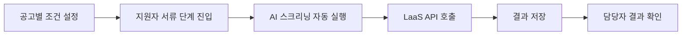

# 서류 검토(AI 스크리닝) 기능 현재 상태 분석

> **분석일:** 2026.01.20  
> **분석 범위:** `when-front`, `round-server`

---

## 1. 📊 기능 개요

**AI 스크리닝**은 채용 담당자가 설정한 조건을 기반으로 지원자 이력서를 AI가 자동 분석하여 적합도를 판단하는 기능입니다.

### 핵심 워크플로우


---

## 2. 🗄️ Backend 아키텍처

### 2.1 데이터 모델

```
ScreeningCandidate (지원자별 스크리닝 결과)
├── id, organization_id, candidate_id, job_id
├── score (평균 점수)
├── summary_evaluation (요약 평가)
├── screening_json_info (AI 응답 원본)
├── success (성공 여부)
├── screening_at (실행 시각)
└── criteria_1_result, criteria_2_result, criteria_3_result (캐시)

    └── ScreeningCriteria (조건별 결과)
        ├── title, detailed_description
        ├── result (Met/Uncertain/NotMet)
        └── result_score
        
            └── ScreeningRequirement (세부 요건별 결과)
                ├── kind (필수/우대)
                ├── title
                ├── result, reason
```

### 2.2 주요 파일

| 파일 | 역할 |
|:---|:---|
| [screening_candidate.rb](file:///Users/terry/Terry's%20PM%20Note/round-server/app/models/screenings/screening_candidate.rb) | 스크리닝 결과 모델 |
| [screening_criteria.rb](file:///Users/terry/Terry's%20PM%20Note/round-server/app/models/screenings/screening_criteria.rb) | 조건별 결과 모델 |
| [screening_requirement.rb](file:///Users/terry/Terry's%20PM%20Note/round-server/app/models/screenings/screening_requirement.rb) | 세부 요건 결과 모델 |
| [screening_able.rb](file:///Users/terry/Terry's%20PM%20Note/round-server/app/models/concerns/candidate/screening_able.rb) | 스크리닝 로직 Concern |
| [screening_resume_job.rb](file:///Users/terry/Terry's%20PM%20Note/round-server/app/jobs/candidate/screening_resume_job.rb) | 비동기 작업 Job |
| [screenings_controller.rb](file:///Users/terry/Terry's%20PM%20Note/round-server/app/controllers/api/candidates/screenings_controller.rb) | API 컨트롤러 |

### 2.3 스크리닝 실행 조건 (`screening_able?`)

```ruby
# 다음 조건을 모두 만족해야 실행 가능:
1. job_criteria 설정됨 (공고에 스크리닝 조건 존재)
2. 이력서 content 또는 application_info 존재
3. 스크리닝 미실행 또는 실패 상태
```

### 2.4 AI 연동

- **LaaS API**: `Client::WantedLaasClient.chat_completions(:screening_resume, params)`
- **비동기 처리**: Sidekiq Job (`Candidate::ScreeningResumeJob`)

---

## 3. 💻 Frontend 아키텍처

### 3.1 주요 컴포넌트

| 컴포넌트 | 경로 | 역할 |
|:---|:---|:---|
| [JobScreeningTemplate](file:///Users/terry/Terry's%20PM%20Note/when-front/apps/round/src/components/templates/job/detail/screening/JobScreeningTemplate.tsx) | 공고 상세 > 스크리닝 | 조건 설정 UI (최대 3개) |
| [CandidateScreening](file:///Users/terry/Terry's%20PM%20Note/when-front/packages/round/view/src/candidate/ai-analysis/CandidateScreening/CandidateScreening.tsx) | 공통 View | 스크리닝 결과 표시 |
| [CandidateScreeningAccordion](file:///Users/terry/Terry's%20PM%20Note/when-front/apps/round/src/components/modals/candidate/detail/components/body/evaluation/CandidateScreeningAccordion.tsx) | 후보자 상세 모달 | 아코디언 형태 결과 |
| [CandidateReviewScreeningStatusFilter](file:///Users/terry/Terry's%20PM%20Note/when-front/apps/round/src/components/templates/candidate/list/components/header/CandidateReviewScreeningStatusFilter.tsx) | 후보자 목록 | 스크리닝 결과 필터 |

### 3.2 API Hooks

| Hook | 파일 | 용도 |
|:---|:---|:---|
| `useCandidatesScreening` | [useCandidatesScreening.tsx](file:///Users/terry/Terry's%20PM%20Note/when-front/packages/round/common-api/src/hooks/candidates/useCandidatesScreening.tsx) | 결과 조회 |
| `useCandidatesScreeningMutations` | 동일 | 수동 실행 |
| `useScreeningAnalysis` | [useScreeningAnalysis.ts](file:///Users/terry/Terry's%20PM%20Note/when-front/packages/round/view/src/candidate/ai-analysis/CandidateScreening/hooks/useScreeningAnalysis.ts) | 자동 실행 트리거 |

### 3.3 데이터 모델 (TypeScript)

```typescript
interface ScreeningCandidate {
  candidate_id: number;
  job_id: number;
  summary_evaluation?: string;
  success?: boolean;
  screening_at?: string;
  screening_criterias: ScreeningCriteria[];
}

interface ScreeningCriteria {
  title: string;
  detailed_description: string;
  result: ScreeningResult; // Met | Uncertain | NotMet
  screening_requirements: ScreeningRequirement[];
}
```

### 3.4 자동 실행 로직

```typescript
// useScreeningAnalysis.ts
if (
  app == RoundApp.ROUND &&      // ROUND 앱에서만
  screeningEnabled &&            // 스크리닝 활성화됨
  isAccessible &&                // 권한 있음
  isEmpty(screeningCandidate)    // 결과 없음
) {
  generateScreening(); // 자동 실행
}
```

---

## 4. 🎯 현재 기능 제약사항

| 항목 | 현재 상태 |
|:---|:---|
| **조건 개수** | 최대 3개 |
| **실행 시점** | 서류 단계(Review Stage) 진입 시 |
| **자동 실행** | ROUND 앱에서만 (ROUND_MEMBER 제외) |
| **결과 표시** | Met(충족) / Uncertain(불확실) / NotMet(미충족) |
| **필터링** | 공고별 + 조건별 결과 필터 지원 |

---

## 5. 📁 관련 파일 목록

### Backend (round-server)
- `app/models/screenings/` - 모델 3개
- `app/models/concerns/candidate/screening_able.rb` - 핵심 로직
- `app/jobs/candidate/screening_resume_job.rb` - 비동기 Job
- `app/controllers/api/candidates/screenings_controller.rb` - API

### Frontend (when-front)
- `apps/round/src/components/templates/job/detail/screening/` - 조건 설정 UI
- `packages/round/view/src/candidate/ai-analysis/CandidateScreening/` - 결과 표시
- `packages/round/common-api/src/hooks/candidates/` - API hooks
- `packages/round/model/src/interfaces/screenings/` - 타입 정의
- `packages/round/helper/src/helpers/candidate/candidate-screening-helper.ts` - 헬퍼

---

## 6. 🔍 개선 기회 (Discovery 대상)

1. **조건 개수 확장** - 현재 최대 3개 제한
2. **ROUND_MEMBER 자동 실행** - 현재 수동 실행만 가능
3. **결과 상세화** - 점수/근거 표시 개선
4. **실시간 피드백** - 스크리닝 진행 상태 표시
5. **재실행 정책** - 현재 조건부 재실행만 가능
