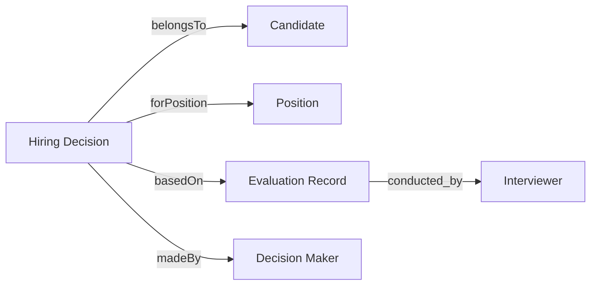

# C-016: Hiring Decision (채용 결정)

## 메타데이터
- **우선순위**: P0
- **도입 버전**: V1.5
- **관련 DCQ**: DCQ-05, DCQ-06, DCQ-07, DCQ-08
- **작성일**: 2024-11-27

## 정의 (Definition)

채용 프로세스의 최종 결과로, 특정 포지션에 지원한 후보자에 대한 합격/불합격 결정과 그 사유를 나타냅니다.

이 개념은 평가 프로세스의 종착점이며, 향후 채용 기준 최적화를 위한 핵심 학습 데이터입니다. 각 결정은 평가 점수, 인터뷰 피드백, 조직의 채용 기준을 종합하여 내려지며, 이후 "왜 이 후보자를 선택/거부했는가"를 추적 가능하게 만듭니다.

## 비즈니스 가치 (Business Value)

이 개념이 해결하는 DCQ:

- **DCQ-05 (합격자 벤치마크)**: `decision="Hired"`인 케이스들의 `finalScore`와 `evaluationBreakdown`을 분석하여 포지션별 합격 기준을 도출
- **DCQ-06 (Pass/Fail 기준점)**: `finalScore`와 `decision`의 상관관계를 통해 암묵적 컷라인 발견
- **DCQ-07 (탈락 패턴)**: `decision="Rejected"`인 케이스의 `decisionReason`과 `weakAreas`를 분석하여 공통 탈락 사유 파악
- **DCQ-08 (예외 케이스)**: 높은 점수(`finalScore > 4.0`)인데 탈락하거나, 낮은 점수인데 합격한 케이스의 `contextualFactors` 분석

## 속성 (Properties)

| 속성명 | 타입 | 필수 | 설명 | 예시 |
|--------|------|------|------|------|
| decisionID | string | ✓ | 고유 식별자 | "HD-2024-001" |
| candidateID | string | ✓ | 후보자 참조 | "CAND-2024-123" |
| positionID | string | ✓ | 포지션 참조 | "POS-BE-SR-001" |
| decision | enum | ✓ | 최종 결정 | "Hired" |
| decisionDate | datetime | ✓ | 결정 일시 | "2024-11-20T15:30:00Z" |
| decisionReason | text | ✓ | 상세 사유 | "Strong technical skills..." |
| decisionMaker | string | ✓ | 최종 결정권자 이메일 | "james@company.com" |
| finalScore | float | ✓ | 최종 종합 점수 (0-5) | 4.3 |
| evaluationBreakdown | object |  | 영역별 점수 세부 | {"technical": 4.5, "communication": 4.2} |
| weakAreas | array[string] |  | 취약 영역 태그 | ["algorithm-optimization", "system-design"] |
| contextualFactors | text |  | 점수 외 고려사항 | "Immediate availability, strong culture fit" |
| offerDetails | object |  | 제안 내용 (합격 시) | {"salary": 85000000, "startDate": "2025-01-02"} |
| notes | text |  | 추가 메모 | "Consider for future senior position" |

### 속성 상세

#### decisionID
- **타입**: string
- **제약**: 고유값, 형식 `HD-YYYY-NNN` (예: HD-2024-001)
- **비즈니스 규칙**: 시스템 자동 생성, 수동 수정 불가
- **DCQ 활용**: 다른 평가 데이터와 조인하여 시계열 분석

#### decision (enum)
- **가능한 값**:
  - `Hired`: 합격 (오퍼 수락 완료)
  - `Rejected`: 불합격
  - `Withdrawn`: 후보자 사퇴
  - `On Hold`: 보류 (예: 예산 대기, 추가 검토)
- **비즈니스 규칙**: `Hired`인 경우 `offerDetails` 필수
- **DCQ 활용**: DCQ-05/06/07의 필터 조건

#### finalScore
- **타입**: float (0.0 - 5.0)
- **계산 방식**: 가중 평균 (기술 60% + 커뮤니케이션 30% + 문화적합성 10%)
- **비즈니스 규칙**: 소수점 첫째자리까지 표기
- **DCQ 활용**: DCQ-06 (컷라인 분석), DCQ-08 (예외 케이스)

#### evaluationBreakdown
- **구조**:
```json
{
  "technical": 4.5,
  "communication": 4.2,
  "cultureFit": 4.0,
  "leadershipPotential": 3.8
}
```
- **비즈니스 규칙**: 모든 하위 점수도 0-5 범위
- **DCQ 활용**: DCQ-05 (합격자 영역별 벤치마크)

#### decisionReason
- **가이드라인**: 객관적 근거 중심 (주관적 표현 최소화)
- **나쁜 예시**: "그냥 별로였음"
- **좋은 예시**: "PostgreSQL 실무 경험 부족 (2.5/5), 알고리즘 최적화 능력 미달 (2.0/5)"
- **DCQ 활용**: DCQ-07 (탈락 패턴 텍스트 분석)

#### weakAreas (array)
- **목적**: 정형화된 태그로 탈락 사유 카테고리화
- **예시**: `["algorithm-optimization", "system-design", "communication-clarity"]`
- **비즈니스 규칙**: 사전 정의된 태그 리스트 사용 (자유 텍스트 불가)
- **DCQ 활용**: DCQ-07 (빈도 분석)

#### contextualFactors
- **목적**: 점수만으로 설명 불가능한 결정 요인 기록
- **예시**:
  - "Immediate availability (start within 2 weeks)"
  - "Previously worked at FAANG company"
  - "Team requested specific frontend expertise"
- **DCQ 활용**: DCQ-08 (예외 케이스 맥락 이해)

## 관계 (Relationships)



| 관계명 | 대상 개념 | 카디널리티 | 설명 |
|--------|-----------|------------|------|
| belongsTo | Candidate | N:1 | 한 결정은 한 후보자에게 속함 (한 후보자는 여러 포지션 지원 가능) |
| forPosition | Position | N:1 | 한 결정은 한 포지션에 대한 것 |
| basedOn | Evaluation Record | N:M | 여러 인터뷰/평가 기록을 종합하여 결정 |
| madeBy | Decision Maker | N:1 | 최종 결정권자 (보통 채용 관리자 또는 HR 리드) |

### 관계 상세: basedOn (Evaluation Record)

이 관계는 **N:M**입니다:
- 한 Hiring Decision은 여러 Evaluation Record(기술 인터뷰, 문화 인터뷰, 레퍼런스 체크 등)를 기반으로 함
- 한 Evaluation Record는 여러 Decision에 영향을 줄 수 있음 (예: 복수 포지션 동시 검토)

**쿼리 예시**:
```sql
SELECT
  hd.decisionID,
  hd.finalScore,
  COUNT(er.evaluationID) as num_evaluations,
  AVG(er.score) as avg_evaluation_score
FROM HiringDecision hd
JOIN EvaluationRecord er ON hd.decisionID = er.decisionID
WHERE hd.decision = 'Hired'
GROUP BY hd.decisionID
```

## 데이터 예시 (JSON Schema)

```json
{
  "$schema": "http://json-schema.org/draft-07/schema#",
  "type": "object",
  "properties": {
    "decisionID": {"type": "string", "pattern": "^HD-\\d{4}-\\d{3}$"},
    "candidateID": {"type": "string"},
    "positionID": {"type": "string"},
    "decision": {"type": "string", "enum": ["Hired", "Rejected", "Withdrawn", "On Hold"]},
    "decisionDate": {"type": "string", "format": "date-time"},
    "decisionReason": {"type": "string", "minLength": 20},
    "decisionMaker": {"type": "string", "format": "email"},
    "finalScore": {"type": "number", "minimum": 0, "maximum": 5},
    "evaluationBreakdown": {
      "type": "object",
      "properties": {
        "technical": {"type": "number", "minimum": 0, "maximum": 5},
        "communication": {"type": "number", "minimum": 0, "maximum": 5},
        "cultureFit": {"type": "number", "minimum": 0, "maximum": 5}
      }
    },
    "weakAreas": {"type": "array", "items": {"type": "string"}},
    "contextualFactors": {"type": "string"},
    "offerDetails": {
      "type": "object",
      "properties": {
        "salary": {"type": "number"},
        "startDate": {"type": "string", "format": "date"}
      }
    },
    "notes": {"type": "string"}
  },
  "required": ["decisionID", "candidateID", "positionID", "decision", "decisionDate", "decisionReason", "decisionMaker", "finalScore"]
}
```

### 실제 데이터 샘플

#### 샘플 1: 합격 케이스 (강력한 기술 역량)

```json
{
  "decisionID": "HD-2024-001",
  "candidateID": "CAND-2024-123",
  "positionID": "POS-BE-SR-001",
  "decision": "Hired",
  "decisionDate": "2024-11-20T15:30:00Z",
  "decisionReason": "Strong technical skills (PostgreSQL 4.5/5, React 4.2/5), excellent communication during technical deep-dive, demonstrated system design thinking in whiteboard session",
  "decisionMaker": "james@company.com",
  "finalScore": 4.3,
  "evaluationBreakdown": {
    "technical": 4.5,
    "communication": 4.2,
    "cultureFit": 4.0,
    "leadershipPotential": 4.0
  },
  "weakAreas": [],
  "contextualFactors": "Immediate availability, previously led team of 5 at Series B startup",
  "offerDetails": {
    "salary": 85000000,
    "startDate": "2025-01-02",
    "equity": "0.15%"
  },
  "notes": "Strong hire, consider for tech lead track"
}
```

#### 샘플 2: 불합격 케이스 (기술 역량 부족)

```json
{
  "decisionID": "HD-2024-002",
  "candidateID": "CAND-2024-124",
  "positionID": "POS-BE-SR-001",
  "decision": "Rejected",
  "decisionDate": "2024-11-21T10:15:00Z",
  "decisionReason": "PostgreSQL experience insufficient (2.5/5 - only basic CRUD), algorithm optimization weak (2.0/5 - could not solve medium-level problem), system design immature (2.5/5)",
  "decisionMaker": "james@company.com",
  "finalScore": 2.6,
  "evaluationBreakdown": {
    "technical": 2.5,
    "communication": 3.5,
    "cultureFit": 3.0,
    "leadershipPotential": 2.0
  },
  "weakAreas": ["postgresql-advanced", "algorithm-optimization", "system-design"],
  "contextualFactors": "",
  "offerDetails": null,
  "notes": "Consider for junior position if reapplies after 6 months"
}
```

#### 샘플 3: 예외 케이스 (높은 점수인데 불합격)

```json
{
  "decisionID": "HD-2024-003",
  "candidateID": "CAND-2024-125",
  "positionID": "POS-FE-MID-002",
  "decision": "Rejected",
  "decisionDate": "2024-11-22T14:00:00Z",
  "decisionReason": "Strong technical skills (React 4.5/5, TypeScript 4.3/5) but cultural misalignment detected - prefers solo work, uncomfortable with pair programming, expressed reluctance about daily standups",
  "decisionMaker": "sarah@company.com",
  "finalScore": 4.1,
  "evaluationBreakdown": {
    "technical": 4.5,
    "communication": 3.8,
    "cultureFit": 2.0,
    "leadershipPotential": 4.0
  },
  "weakAreas": ["team-collaboration"],
  "contextualFactors": "Team operates with heavy pair programming and daily sync culture - critical mismatch",
  "offerDetails": null,
  "notes": "Technical talent but not right fit for our collaborative environment"
}
```

## 쿼리 시나리오 (DCQ 연결)

### DCQ-05: 합격자 벤치마크

**질문**: "백엔드 시니어 포지션 합격자들의 평균 기술 점수는?"

```pseudocode
SELECT
  positionID,
  AVG(evaluationBreakdown.technical) as avg_technical_score,
  AVG(evaluationBreakdown.communication) as avg_communication_score,
  AVG(finalScore) as avg_overall_score,
  COUNT(*) as num_hired
FROM HiringDecision
WHERE decision = "Hired"
  AND positionID LIKE "POS-BE-SR-%"
GROUP BY positionID
```

**예상 결과**:
```
positionID         | avg_technical | avg_communication | avg_overall | num_hired
-------------------|---------------|-------------------|-------------|----------
POS-BE-SR-001      | 4.3           | 4.1               | 4.2         | 3
```

**비즈니스 해석**: 백엔드 시니어 합격자는 기술 4.3, 커뮤니케이션 4.1 이상이 벤치마크

---

### DCQ-06: Pass/Fail 기준점

**질문**: "최종 점수 3.5와 4.0 사이에서 합격/불합격이 갈리는 경계는?"

```pseudocode
SELECT
  finalScore,
  decision,
  COUNT(*) as count
FROM HiringDecision
WHERE finalScore BETWEEN 3.5 AND 4.5
GROUP BY finalScore, decision
ORDER BY finalScore DESC
```

**예상 결과**:
```
finalScore | decision  | count
-----------|-----------|------
4.3        | Hired     | 2
4.1        | Rejected  | 1  ← 예외 케이스
3.8        | Hired     | 1
3.6        | Rejected  | 3
```

**비즈니스 해석**: 암묵적 컷라인은 3.8-4.0 사이, 단 4.1에서 불합격은 contextualFactors 분석 필요

---

### DCQ-07: 탈락 패턴

**질문**: "가장 흔한 탈락 사유는?"

```pseudocode
SELECT
  weakArea,
  COUNT(*) as frequency,
  AVG(finalScore) as avg_score_when_failed
FROM HiringDecision
CROSS JOIN UNNEST(weakAreas) AS weakArea
WHERE decision = "Rejected"
GROUP BY weakArea
ORDER BY frequency DESC
LIMIT 5
```

**예상 결과**:
```
weakArea                  | frequency | avg_score_when_failed
--------------------------|-----------|----------------------
algorithm-optimization    | 8         | 2.4
system-design             | 6         | 2.7
postgresql-advanced       | 5         | 2.6
communication-clarity     | 4         | 3.1
team-collaboration        | 2         | 3.8
```

**비즈니스 해석**: 알고리즘/시스템 설계가 가장 흔한 탈락 사유, 협업 능력 부족은 드물지만 고득점자도 탈락

---

### DCQ-08: 예외 케이스

**질문**: "점수 4.0 이상인데 탈락한 케이스와 그 이유는?"

```pseudocode
SELECT
  decisionID,
  candidateID,
  finalScore,
  decisionReason,
  contextualFactors
FROM HiringDecision
WHERE decision = "Rejected"
  AND finalScore >= 4.0
ORDER BY finalScore DESC
```

**예상 결과**:
```
decisionID  | candidateID    | finalScore | decisionReason               | contextualFactors
------------|----------------|------------|------------------------------|-------------------
HD-2024-003 | CAND-2024-125  | 4.1        | Strong technical but...      | Team operates with heavy pair programming...
```

**비즈니스 해석**: 기술 점수만으로 채용 결정이 안 됨 - 문화적합성이나 팀 역학도 중요 변수

---

## 데이터 수집 전략 (Week 6 준비)

### 필요 샘플 수
- **최소**: 5건 (합격 3건 + 불합격 2건)
- **권장**: 10건 (합격 5건 + 불합격 4건 + 예외 케이스 1건)

### 수집 방법
1. **옵션 A (실제 데이터)**: 보리와 협의하여 최근 3개월 채용 데이터 익명화 추출
   - 장점: 현실성, 실제 패턴 반영
   - 단점: 데이터 접근 권한, 개인정보 보호 이슈

2. **옵션 B (합성 데이터)**: 보리와 함께 가상 시나리오 작성
   - 장점: 즉시 시작 가능, 극단 케이스 포함 가능
   - 단점: 현실성 검증 필요

### 검증 포인트
- [ ] `finalScore`와 `decision`의 일관성 (합격자 평균 > 불합격자 평균)
- [ ] `evaluationBreakdown`의 가중 평균이 `finalScore`와 일치
- [ ] `decision="Hired"`인 경우 `offerDetails` 누락 없음
- [ ] `weakAreas` 태그가 사전 정의된 리스트에 포함됨

---

## 보리 검토 체크리스트

### 비즈니스 정합성
- [ ] 속성이 실제 채용 의사결정 프로세스를 충실히 반영하는가?
- [ ] `contextualFactors` 같은 정성적 요소가 실제로 기록 가능한가?
- [ ] `decisionReason` 작성 가이드라인이 현실적인가?

### DCQ 유효성
- [ ] DCQ-05 쿼리로 실제 벤치마크를 도출할 수 있는가?
- [ ] DCQ-06 컷라인 분석이 의미 있는 인사이트를 줄 수 있는가?
- [ ] DCQ-07 탈락 패턴이 채용 프로세스 개선에 활용 가능한가?
- [ ] DCQ-08 예외 케이스 분석이 정책 수정의 근거가 될 수 있는가?

### 데이터 수집 가능성
- [ ] Week 6에 실제 샘플 데이터 5-10건을 수집할 수 있는가?
- [ ] 만약 실제 데이터 접근이 어렵다면, 합성 데이터로 대체 가능한가?
- [ ] 익명화 처리 방법이 명확한가?

### 기술적 구현 가능성
- [ ] JSON Schema가 실제 데이터 입력/검증에 사용 가능한가?
- [ ] 관계 모델(N:M, N:1)이 데이터베이스 설계로 구현 가능한가?
- [ ] 쿼리 예시가 실제 SQL/NoSQL 환경에서 실행 가능한가?

---

## 변경 이력
- **2024-11-27**: 초안 작성 (Terry) - P0 개념 문서화 시작
